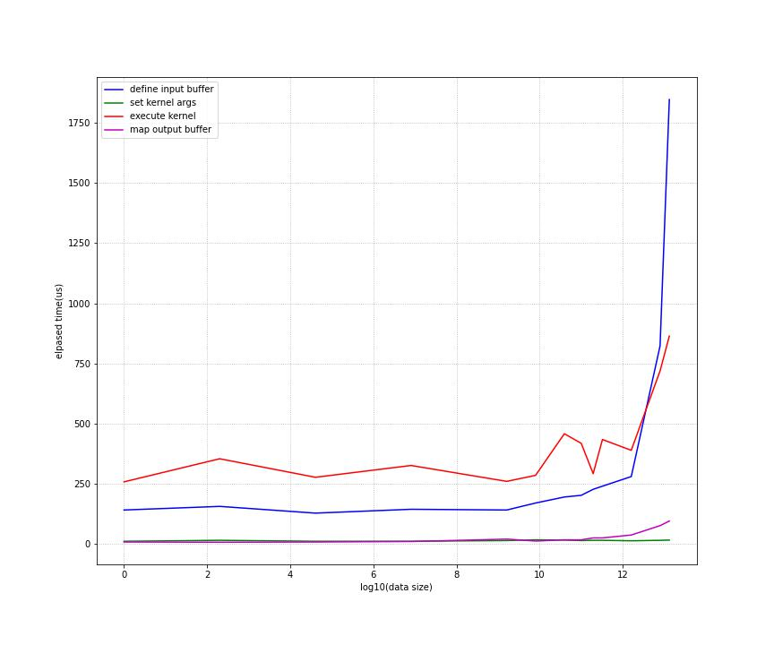

## OpenCL单步操作耗时测量

目的：测试OpenCL各API调用步骤的耗时。

测量环境： huawei matebookx
- CPU: i7-1165G7 @ 2.80GHz
- GPU: Intel(R) Iris(R) Xe Graphics
- RAM: 16G

测试程序：`time_vector_add_cxx_api.cpp`

测试结果：

| VectorSize | 编译Program | 定义入参Buffer | 设置入参 | 运行 | Map出参buffer |
| ---------- | ----------- | -------------- | -------- | ---- | ------------- |
| 1          | 193711      | 141            | 11       | 258  | 8             |
| 10         | 181499      | 156            | 15       | 354  | 7             |
| 100        | 181958      | 128            | 11       | 277  | 8             |
| 1000       | 181206      | 144            | 11       | 326  | 10            |
| 10000      | 192249      | 141            | 14       | 260  | 20            |
| 20000      | 192416      | 170            | 17       | 285  | 12            |
| 40000      | 192205      | 195            | 16       | 458  | 17            |
| 60000      | 183941      | 202            | 14       | 418  | 17            |
| 80000      | 182685      | 227            | 15       | 292  | 25            |
| 100000     | 183394      | 240            | 15       | 434  | 25            |
| 200000     | 176792      | 280            | 13       | 389  | 37            |
| 400000     | 193144      | 823            | 15       | 719  | 76            |
| 500000     | 188913      | 1847           | 16       | 864  | 95            |

现象总结：

- 随着数据量增加，编译Porgram耗时和设置入参的耗时基本不变；设置入参Buffer和运行耗时都有增加的趋势。
- 设置入参Buffer和运行耗时的数据量级相当。
- 随着数据量的增加，运行kernel耗时并不线性增加。